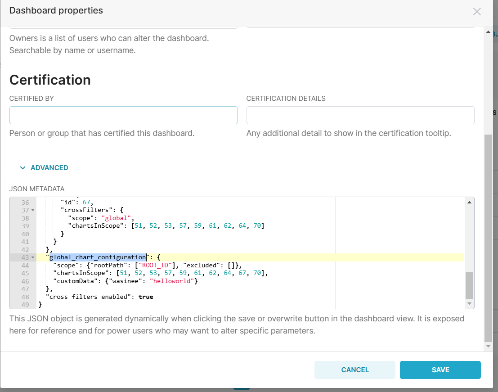

# บันทึกการทดลอง

## 2025-10-20

### customize หน้า Login 

เราสามารถแก้ Template ที่มาจากหลังบ้านได้ด้วยการเข้าไปแก้ที่ : superset/templates/appbuilder โดยทำตามมาตรฐานของ flask-app-builder ดูได้จาก slack :  https://flask-appbuilder.readthedocs.io/en/latest/customizing.html

ตัวอย่างไฟล์ login_db : https://github.com/dpgaspar/Flask-AppBuilder/blob/9067f5a4aa0a632941f67b4c8664108ff8b3ac20/flask_appbuilder/templates/appbuilder/general/security/login_db.html

อันนี้ต้องแก้ที่ flask app ไม่ใช่ส่วน superset-frontend

ที่อยู่ในการเข้าไปแก้ไฟล์คือ

```
superset/templates/appbuilder/general/security/login_db.html
```

### วิธีการ Start app ทั้งหน้าบ้านและหลังบ้านขึ้นมา

ทำตาม Link ด้านล่าง

https://preset.io/blog/tutorial-contributing-code-to-apache-superset/


```
FLASK_ENV=development superset run -p 8088 --with-threads --reload --debugger
```

### Customize Frontend หลัง Login เข้าไปแล้ว

Superset ใช้ React ในการเขียน Frontend โดยไฟล์ส่วนใหญ่จะอยู่ใน

```
superset-frontend/src/pages/Home/index.tsx
```

## 2025-01-21

### หาวิธีเพิ่มค่าเข้าไปใน Dashboard 

เราสามารถเพิ่มค่าเข้าไปใน Dashboard properties ตรง Advance 



จะมี field ชื่อ global_chart_configuration ฟิลล์นี้เราสามารถเพิ่มค่าเข้าไปได้เลย


### จุดรวมการ Route ทั้งหมด

ตรงนี้จะเป็นจุด route ทั้งหมดของ Project frontend

```sh
superset-frontend/src/views/routes.tsx
```


### Dashboard Page

ไฟล์เกี่ยวกับ Dashboard

```
superset-frontend/src/dashboard/containers/DashboardPage.tsx
superset-frontend/src/dashboard/components/DashboardBuilder/DashboardBuilder.tsx
```

## 2025-01-22

### Customize ตัวหน้า Dashboard

ไฟล์เกี่ยวกับ FILTER BAR

```
superset-frontend/src/dashboard/components/nativeFilters/FilterBar/Vertical.tsx
superset-frontend/src/dashboard/components/DashboardBuilder/DashboardWrapper.tsx
```

### ดูเกี่ยวกับ MENU BAR ด้านบนว่า

ไฟล์ที่เกี่ยวข้อง

```
superset-frontend/src/views/menu.tsx
superset-frontend/src/features/home/Menu.tsx
```


## 2025-01-23

### จัด Layout หน้าเว็บทั้งหมด

```
superset-frontend/src/views/App.tsx 
```

จะมีตรงส่วน Code ด้านล่าง

``` js
const App = () => (
  <Router>
    <ScrollToTop />
    <LocationPathnameLogger />
    <RootContextProviders>
      <GlobalStyles />
```

ตรงส่วนนี้เราสามารถปรับ Layout ทั้งหน้าได้ตามใจเรา

## 2025-01-27

### Customize ตัว MetaTag

ต้องทำการเพิ่มไฟล์ที่ : superset/templates/appbuilder/init.html เพื่อทำการ customize ตัว tag ใน Head

ในส่วนของรูปต้องเอาไปวางที่ : superset-frontend/src/assets/images/

